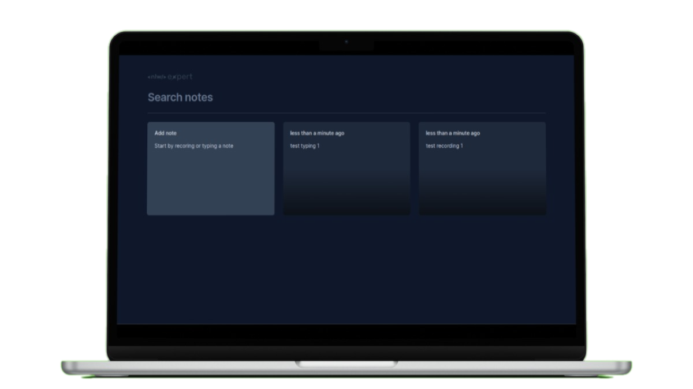
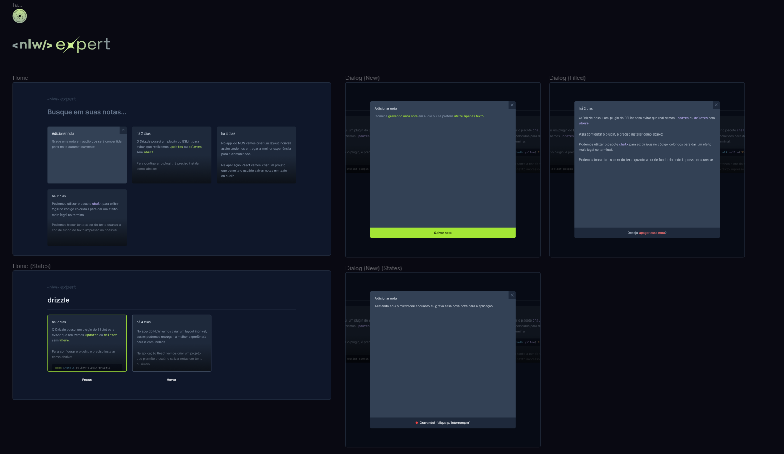

<h3 align="center">
    
</h3>

<h1 align="center"># Expert Notes</h1>

<p align="center">
<a href="#project"></a>&nbsp;
<a href="#layout"></a>&nbsp;
<a href="#environment"></a>&nbsp;
<a href="#license"></a>&nbsp;
</p>

<h3 align="center">
  
</h3>

## Project

This project was undertaken during a [Rockeseat](https://www.rocketseat.com.br/) event, where participants were tasked with building a React application from scratch in just 3 days.
The project idea was to build a web app that stores local notes that can be written or recorded. It is possible to create and delete notes.

### Project Overview
This project provided a comprehensive hands-on experience with React development, covering fundamental concepts and advanced features within a short timeframe.
During the event, the following steps were taken to develop the project:

#### Project Setup:

- Established the project setup using Vite and Tailwind.

#### Initial Interface Development:

- Initiated the static development of the interface.
- Introduced the fundamental concept of React: componentization.

####  React Core Concepts:

- Explored and implemented the concepts of properties and state in React.
- Utilized Radix UI library for modal usage.
- Integrated date-fns library for effective date handling.
- Incorporated Sonner library for displaying toasts.

#### Advanced Features:

- Implemented the SpeechRecognition API to convert user audio into notes.
- Applied the Lifting State Up concept for effective note management.
- Achieved data persistence using LocalStorage.

#### Technologies and Libraries Used:

- Vite
- Tailwind
- React
- Radix UI
- date-fns
- Sonner
- SpeechRecognition API
- LocalStorage

### Demo:

<p align="center">

</p>

> `Alert 1:` For optimal experience, it is advisable not to use IE 6-8 as a browser due to certain styling features.

## Layout

For this challenge, it was necessary to meticulously replicate a design created in Figma. You can view screenshots of the Figma design here:

<p align="center">
  
</p>

## Environment

Make sure you have the following installations:

- [Git](https://git-scm.com/)
- [Node](https://nodejs.org/en)
- [Npm](https://www.npmjs.com/)

### Setup Instructions:

1. Clone the repository:
   ```bash
     https://github.com/CaioLemec/expert-notes.git
   ```
2. Install all dependencies by running:
   ```bash
   npm i
   ```
3. Start the application in <strong>dev</strong> mode:
   ```bash
   npm run dev
   ```

---

## License

Licensed under MIT. Learn more in the [LICENSE](/LICENSE) file.

---

## Contact

Feel free to reach out for clarifications or feedback.


<em align="center">Caio Lemec</em>

[](mailto:caiolemec@gmail.com)
[](https://www.linkedin.com/in/caiolemec/)
